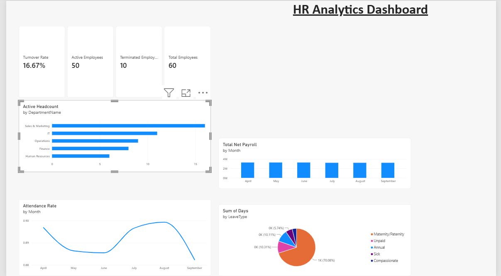

# HR Analytics Dashboard

An end-to-end HR data analytics project — from raw data design through to an interactive Power BI dashboard — built to demonstrate the full data analysis pipeline: collection, entry, storage, cleaning, analysis, and visualization.



## Problem Statement

HR teams in many organizations track employee data — headcount, attendance, leave, and payroll — across scattered spreadsheets, making it slow and error-prone to answer basic but important questions:

- How many employees do we have, and how many have we lost?
- Which departments are overstaffed or understaffed?
- Is attendance improving or declining over time?
- How much are we spending on payroll each month?
- What kinds of leave are employees taking most?

This project builds a lightweight, reusable HR analytics system that answers these questions instantly through an interactive dashboard, instead of requiring someone to manually dig through spreadsheets every time leadership asks.

**Who this is for:** HR managers and department heads who need a quick, visual read on workforce health without waiting on a manual report.

## Data Model

The dataset is structured as five related tables, modeled the way a real HR system would store this data — normalized rather than one giant flat spreadsheet, which is what makes reliable analysis possible.

| Table | Description | Key Field |
|---|---|---|
| **Employees** | Core employee records — name, department, job title, hire/termination date, salary, status | `EmployeeID` |
| **Departments** | Department names and managers | `DeptID` |
| **Attendance** | Monthly attendance summary per employee (working days, present, absent, late) | `EmployeeID` + `Month` |
| **Leave** | Individual leave records — type, start/end date, days taken | `EmployeeID` |
| **Payroll** | Monthly payroll per employee — basic salary, allowances, deductions, net pay | `EmployeeID` + `Month` |

**Relationships:** Employees is the central table, linked one-to-many to Attendance, Leave, and Payroll via `EmployeeID`, and linked to Departments via `DeptID`. This star-schema-style structure lets any metric (attendance, payroll, leave) be sliced by department or by individual employee without duplicating data.

> **Note on the data:** This version uses a realistically generated sample dataset (60 employees across 5 departments, 6 months of records) rather than a real organization's data, so the project can be shared publicly without privacy concerns. The structure is designed to accept real HR data with no changes to the model or dashboard.

## Methodology

**Data cleaning:** Dates (hire date, termination date, leave dates, month fields) were explicitly typed and locale-corrected during import (Power Query) to avoid the common DD/MM vs MM/DD misread that silently corrupts date-based analysis.

**Key metrics (DAX measures):**

```dax
Total Employees = COUNTROWS(Employees)

Active Employees = CALCULATE(COUNTROWS(Employees), Employees[Status] = "Active")

Terminated Employees = CALCULATE(COUNTROWS(Employees), Employees[Status] = "Terminated")

Turnover Rate = DIVIDE([Terminated Employees], [Total Employees], 0)

Attendance Rate = DIVIDE(SUM(Attendance[DaysPresent]), SUM(Attendance[WorkingDays]))

Total Net Payroll = SUM(Payroll[NetPay])

Active Headcount = CALCULATE(COUNTROWS(Employees), Employees[Status] = "Active")
```

Turnover rate, for example, isn't just a displayed number — it's calculated as terminated employees divided by total employees ever recorded, so it reflects the true proportion of staff who have left rather than just a headcount difference.

## Dashboard

The dashboard combines four KPI cards with four supporting visuals:

- **KPI cards:** Total Employees, Active Employees, Terminated Employees, Turnover Rate
- **Headcount by Department** (bar chart) — shows workforce distribution across departments
- **Attendance Rate Trend** (line chart) — tracks attendance over 6 months
- **Monthly Payroll Cost** (column chart) — tracks total net payroll spend over time
- **Leave Days by Type** (pie chart) — breaks down leave usage by category

## Key Findings (from the sample dataset)

- Overall turnover rate sits at **16.67%** (10 of 60 employees terminated)
- **Sales & Marketing** has the largest headcount of all departments, making it the most exposed to turnover risk in raw numbers
- Attendance rate holds in the **88–90%** range across all 6 months, dipping slightly mid-period before recovering
- **Maternity/Paternity leave** accounts for the largest share of leave days taken (70%), followed by Annual leave

## Tools Used

- **Microsoft Excel** — initial data modeling, formulas, and first-pass dashboard
- **Power BI Desktop** — data import (Power Query), relationship modeling, DAX measures, final interactive dashboard
- **Python (pandas)** — sample dataset generation

## Next Steps

- Replace sample data with a real or public HR dataset for a production-grade version
- Add drill-through pages per department
- Add year-over-year comparison once multiple years of data are available

---
*Built by Josephat, Diploma in Information Technology, Mount Kenya University.*
